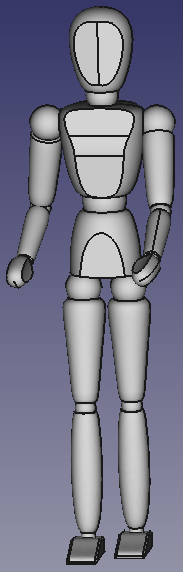

# Mannequin_mp - set of human like dummy dolls

This set of dummies/dolls is dedicated for FreeCAD assemblies
(Assembly4 primarily) as simple addons for visualisation and
for basic ergonomy studies.

I, author of these models, Martin Prokš (martin.proks@proks-martin.cz)
i'm giving these models free to use, without copyrights or limitation.
There is no waranty of usabylity or correctnes of these models.
These models has been modelled from scratch in FreeCAD 0.21.2.
As inspiration served pictures of common Mannequins and
Leonardo da Vinci's drawing of a man in a circle and rectangle.

Note: The suffix *\_mp* means just sign of author (Martin Proks).
There could be many different Mannequins in future.

There is more versions od the Mannequin in different possitions.

## Usage of the models

Just select some file .FCStd and open it, or add it into an assembly
(Assembly4).

## Changing of possition

You can easily change position of the model by transformation
of body parts of the Mannequin. For easy connection of the parts
there are named local coordinates systems of body joints.
