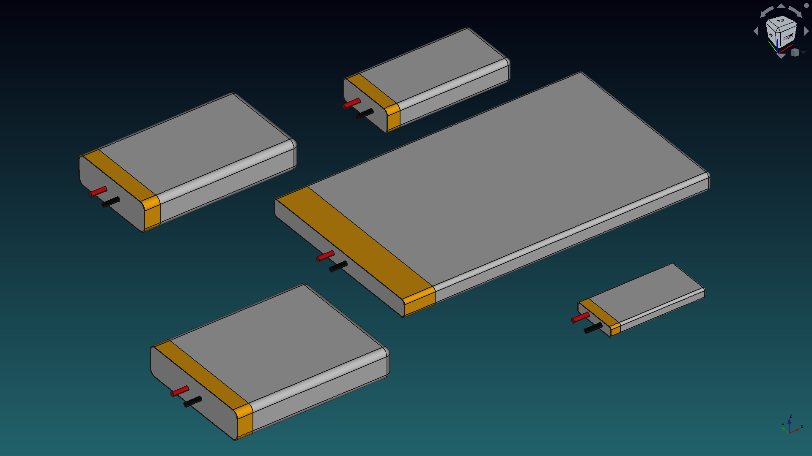

# Batteries

In this folder you can find some batteries.

Check the images below to see if there is something of your interest.

Feel free to change it to your needs and share it with us. 😀

## 9V battery

9V battery

## Parametric LiPo batteries

A small set of different 3.7 [V] LiPo batteries, check them in the `Spreadsheet` and modify to your needs. It features a `Configuration Table`  to change the size without opening the Spreadsheet.

These are the provided dimensions.

| Capacity [mAh] | Length [mm] | Wide  [mm] | Height  [mm] |
| :------------: | :---------: | :--------: | :----------: |
|      130       |     32      |    15.5    |     3.5      |
|      250       |     32      |    20.5    |      5       |
|      400       |     37      |    20.5    |      6       |
|      650       |     42      |    20.5    |      8       |
|      1000      |     52      |    34.5    |      5       |
|      1200      |     42      |    30.5    |      10      |
|      1500      |     52      |    30.5    |      10      |
|      2000      |    97.5     |    33.5    |      5       |
|      2500      |     52      |    40.5    |      10      |
|      4000      |     93      |    60.5    |      6       |
|      5000      |     103     |    60.5    |      6       |

