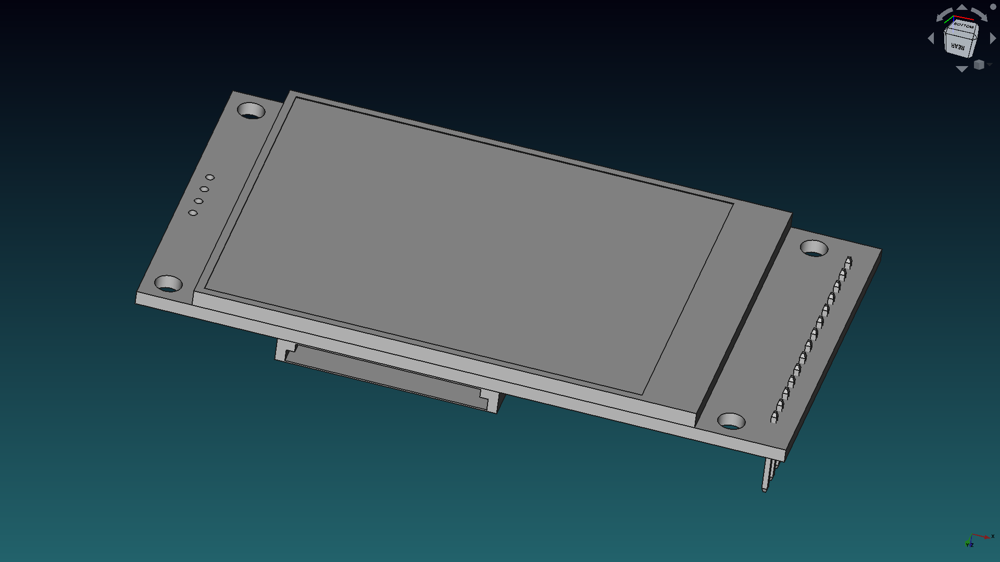
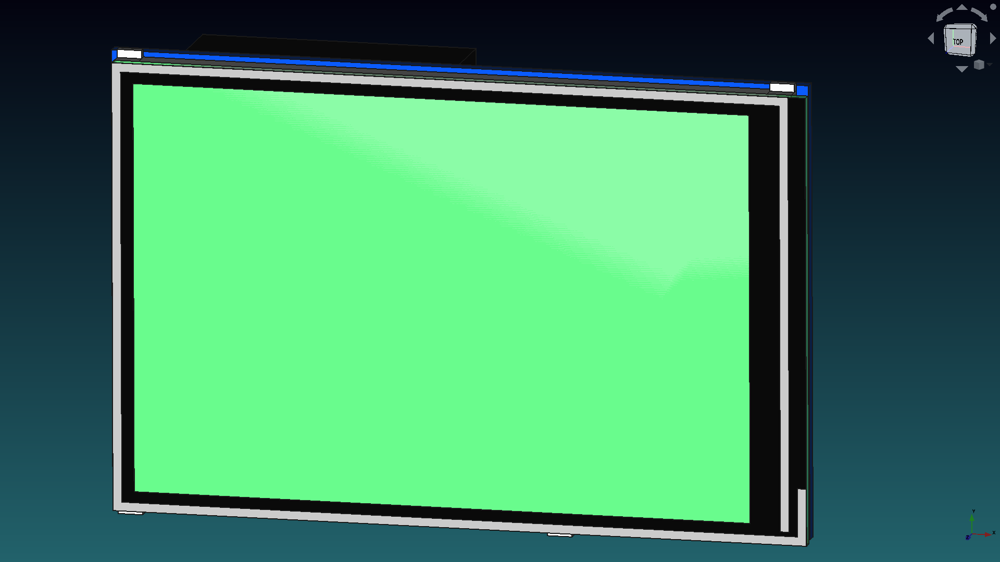

# TFT Display

In this folder you can find common available TFT displays.

Don't forget to share your modifications with the community.

## 2.4 in TFT display

Commonly used with Arduino microcontroller boards.

## 3.5 in TFT display

Commonly used with Raspberry Pi Single Board Computers.

