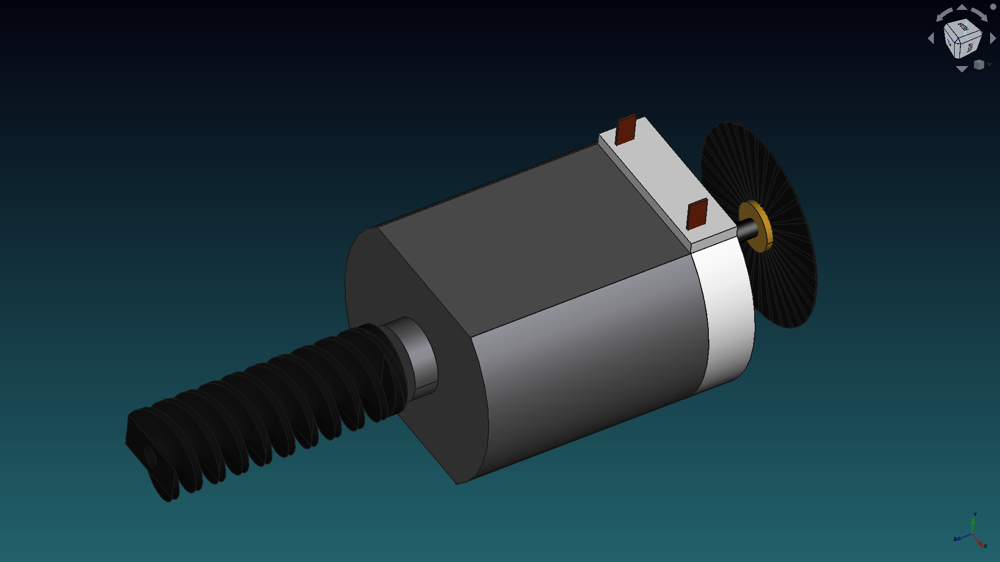
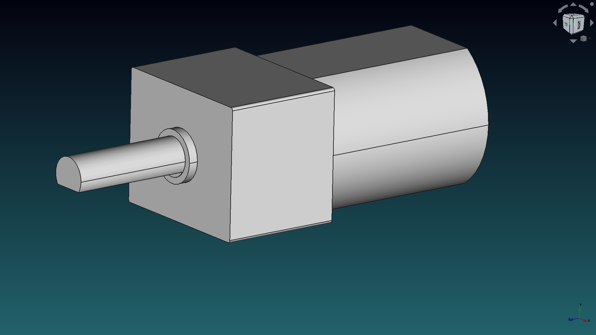
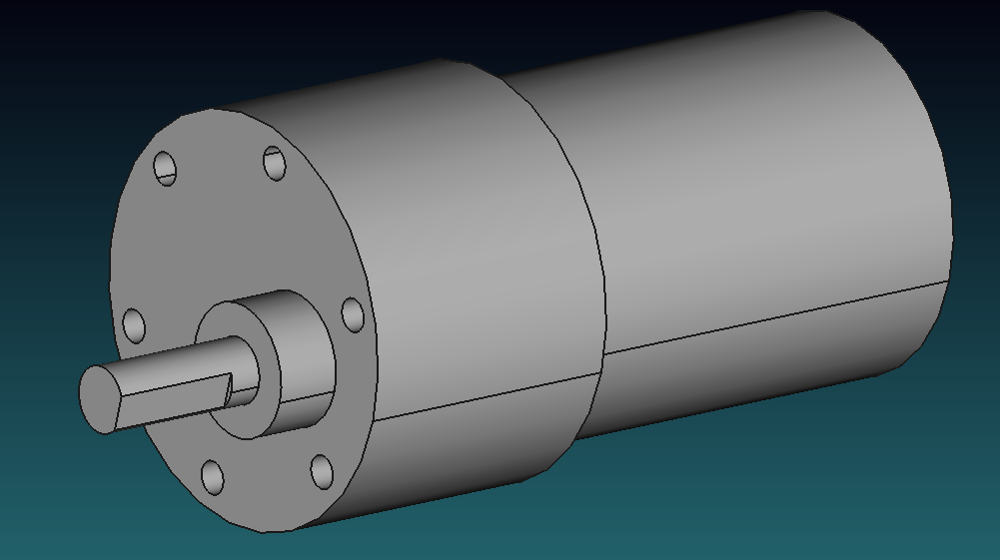
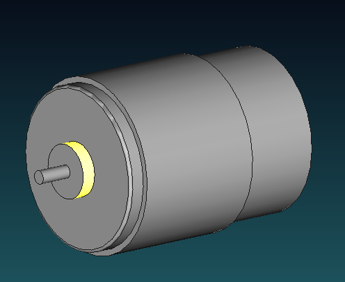
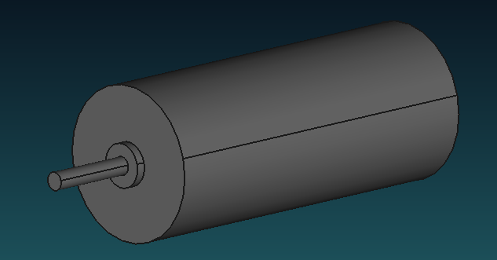
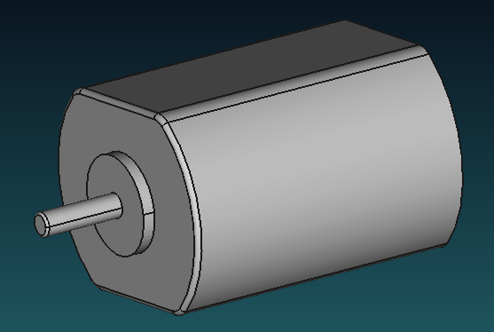
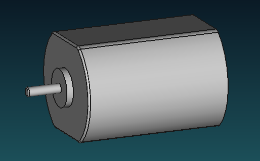

# DC motors

In this folder you can find some DC motors.

Don't forget to share your modifications with the community.

##  FAULHABER 2342L-012CPR

This is a very detailed FAULHABER 2342L-012CPR motor model created just to celebrate the release of [FreeCAD 0.20](https://wiki.freecadweb.org/Release_notes_0.20) =P
**Note**: You can open this model in FreeCAD but to be able to modify the *fasteners* and the *gears* you will need to download the [Fasteners_Workbench](https://wiki.freecadweb.org/Fasteners_Workbench) and the [FCGear_Workbench](https://wiki.freecadweb.org/FCGear_Workbench), dowload them using the [Std_AddonMgr](https://wiki.freecadweb.org/Std_AddonMgr).

Check this video of the motor showcasing FreeCAD: https://youtu.be/-KUMqJL786w

## Mabuchi FA_130RA

Mabuchi FA_130RA motor with enconder and worm included. Very cool.

## Pololu 298:1

Simplified version of Pololu Micro Metal Gearmotor 298:1.

## Gear motor

## Other

