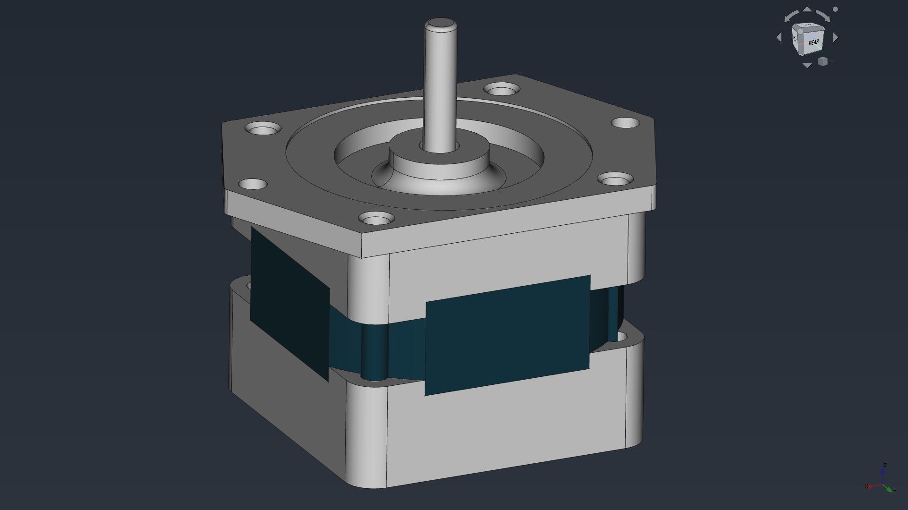

# Stepper motors

In this folder you can find some stepper motors.

Don't forget to share your modifications with the community.

## NEMA

### NEMA 17

### NEMA 23

## 28BYJ-48

## EM-286

The EM-286 Shimano STH-39H112-06 is a stepper motor recovered from old FX880, FX890, FX2180, and other EPSON matrix printers. Check the [Reverse Engineered Specification](https://ufj.ddns.net/blog/3d/2020/05/19/epson-stepper-em-286-sth-39h112-06-reverse-engineered-specs.html) made by Thiago Borges to see the specifications of this motor.

