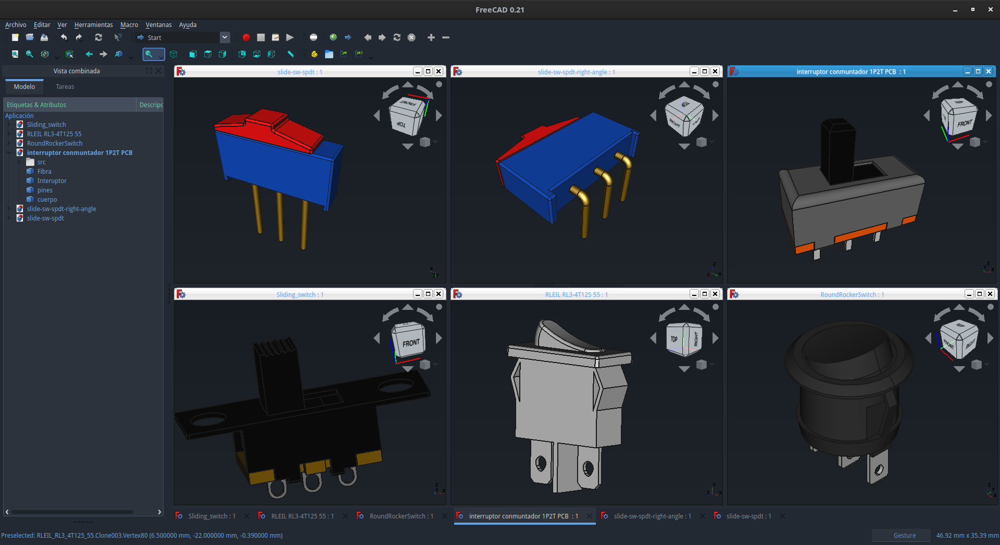

# Switch

We have here a few models of switches

Feel free to change it to your needs and share it with us. 😀

## Mini Rocker Switches

### Without red LED

### With red LED

## Microswitch SPDT from XKB Connectivity

### Vertical

This model is [XKB Connectivity DM1-16UP-1](https://lcsc.com/product-detail/Microswitches_XKB-Connectivity-DM1-16UP-1_C405950.html).

### Horizontal right

This model is [XKB Connectivity DM1-16UC-1](https://lcsc.com/product-detail/Microswitches_XKB-Connectivity-DM1-16UC-1_C466019.html).

### Horizontal left

This model is [XKB Connectivity DM1-16UD-1](https://lcsc.com/product-detail/Microswitches_XKB-Connectivity-DM1-16UD-1_C466013.html).

## More switches

