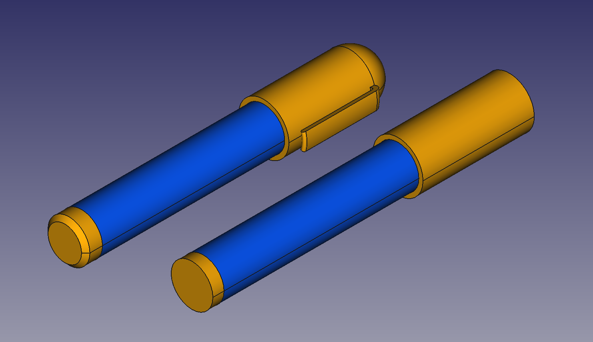

# Scale model - Bourjault's ballpoint pen

This directory contains the original (left) and simplified (right) FreeCAD models of Bourjault's ballpoint pen used by the [ACRO](https://iiw.kuleuven.be/onderzoek/acro) research unit ([KU Leuven](https://www.kuleuven.be/kuleuven/)) to develop and test state-of-the-art assembly sequence planning algorithms. Each file is available in the .FCStd, .stp and .stl formats.

## Created with
* FreeCAD 0.18.4 (Stable)
* [A2plus 0.4.47 workbench](https://github.com/kbwbe/A2plus)
* Ubuntu 20.04 LTS

## Author
* [Martijn Cramer](https://github.com/MartijnCramer)

## License
All parts in this repository are licensed under [CC-BY 3.0](https://creativecommons.org/licenses/by/3.0/). Each part is copyrighted by and should be attributed to its respective author(s).

## Acknowledgments
* [KU Leuven](https://iiw.kuleuven.be/english/diepenbeek) @ Diepenbeek Campus
* Automation, Computer vision and Robotics ([ACRO](https://iiw.kuleuven.be/onderzoek/acro)) research unit

## References
Bourjault, A., 1984, Contribution à une approche méthodologique de l’assemblage automatisé: elaboration automatique des séquences opératoires (Contribution to a systematic
approach of automatic assembly: automatic generation of task sequences). Ph.D. Thesis, Besançon, France: Université de Franche-Comté, (in French).
