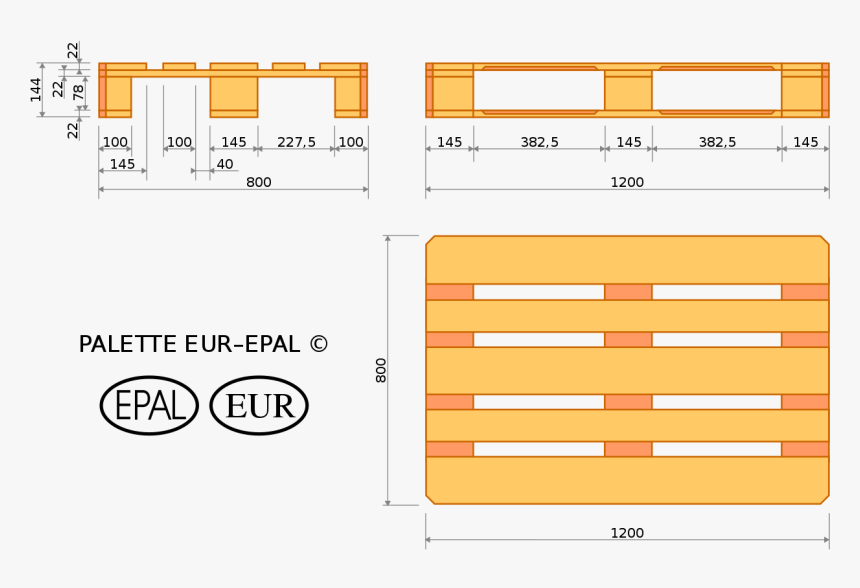
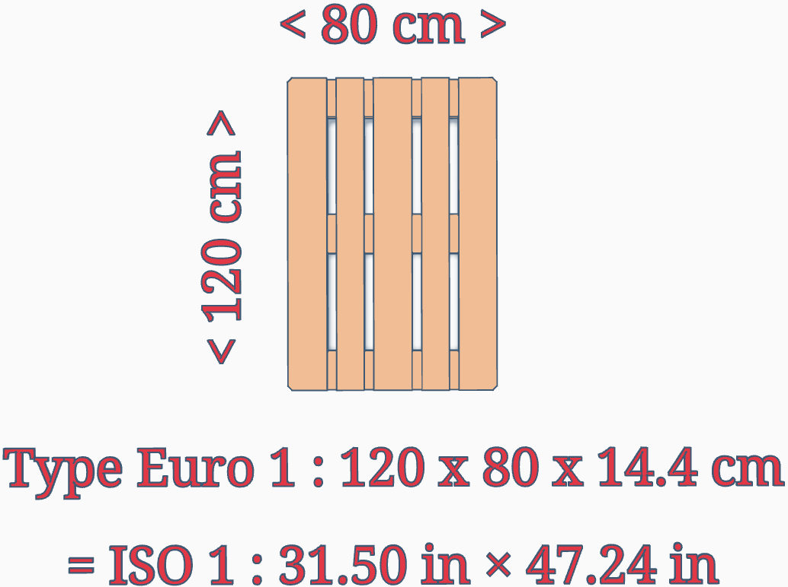

# Euro Palette Type 1

The Euro-pallet standardises storage elements in international shipping.  The UNE-EN 13698-1 standard first specified a wooden structure with an overall size of 800 x 1,200 mm.

There are many methods used for constructing euro-pallets but the standard is constructed from 11 planks and 9 blocks of wood weighing about 25 kg and able to be loaded with up to 1.5 tonnes if it will be carried or up to 4 tonnes if used only as static storage.
## Model Sources

other representations of the standard Euro Palettes are available

### bytebasher in Thingverse
model of the Euro Palette Type 1 ]
