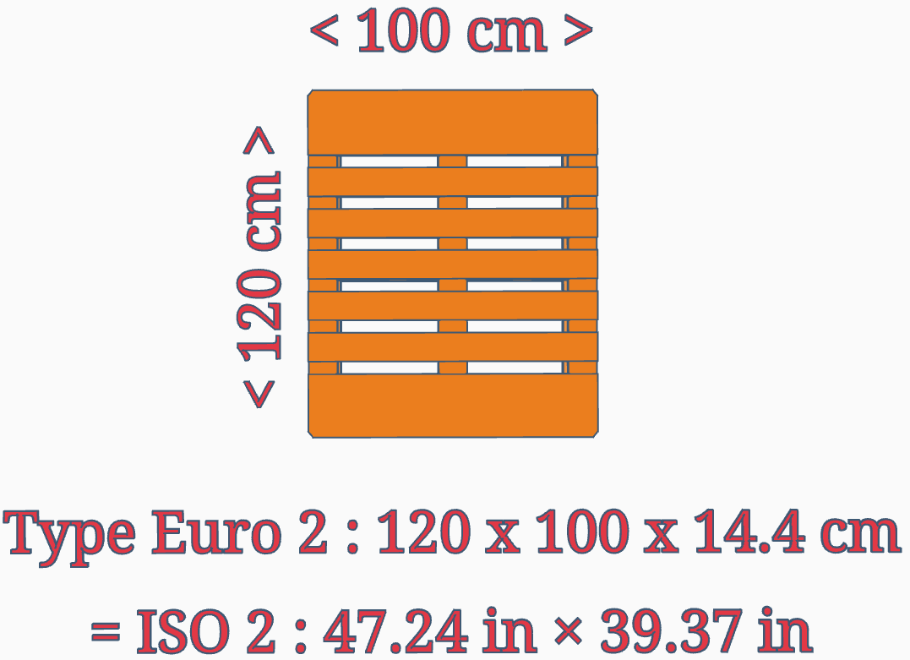

= Euro Palette Type 2

The Euro-pallet standardises storage elements in international shipping.

The type 2 palette is 1200 x 1000 mm, 20 % larger than the standard type 1 palette. 
It is the same size as the type 3 but closed on both sides.

