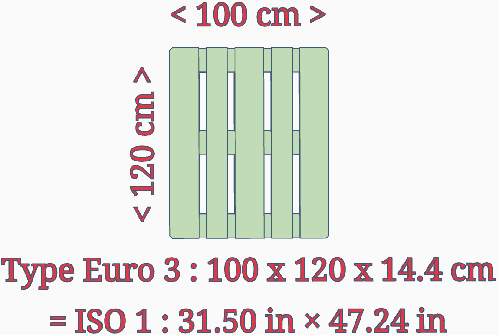

# Euro Palette Type 3

The Euro-pallet standardises storage elements in international shipping.

The type 3 palette is 1000 x 1200 mm, 20 % larger than the standard type 1 palette, 
which is the same size as the type 2 but open on the bottom of the short side instead of 
being closed.

