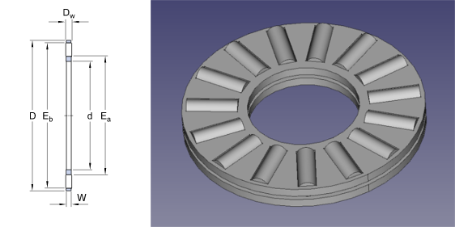

# Parametric Axial Bearing

Using Spreadsheet workbench.

Dimensions can be found at bearings catalogues. [For example](http://www.skf.com/group/products/bearings-units-housings/roller-bearings/needle-roller-thrust-bearings/ndl-rllr-and-cage-thrust-assmbl/index.html)

