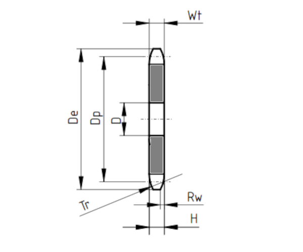

# Chain Plate Wheels ISO606 simplex 8 x 3 from z 8 to z 50

This folder contains the 3D models of the plate wheels for ISO 606 chains simplex 8 x 3 with number of teeth ranging from z=8 to z=50.

The model is parametric and the values are contained in the spreadsheet `Data`.

The parameters refer to the plate wheel dimensions as in the drawing below:

### Table of dimensions in millimeters:

P (Pitch)|Wc (Chain width)|Dr (Roller diameter)|Tr (Tooth radius)|Rw (Radius width)|Wt (Tooth width)|z (Number of teeth)|De (External Diameter)|Dp (Pitch diameter)|D (Hole diameter)|H (Total height)
---|---|---|---|---|---|---|---|---|---|---
8|3|5|8|1|2,8|8|24|20,9|6|2,8
8|3|5|8|1|2,8|9|26,6|23,39|6|2,8
8|3|5|8|1|2,8|10|29,2|25,89|8|2,8
8|3|5|8|1|2,8|11|31,7|28,39|8|2,8
8|3|5|8|1|2,8|12|34,2|30,91|8|2,8
8|3|5|8|1|2,8|13|36,7|33,42|8|2,8
8|3|5|8|1|2,8|14|39,2|35,95|8|2,8
8|3|5|8|1|2,8|15|41,7|38,48|8|2,8
8|3|5|8|1|2,8|16|44,3|41,01|8|2,8
8|3|5|8|1|2,8|17|46,8|43,53|8|2,8
8|3|5|8|1|2,8|18|49,3|46,07|8|2,8
8|3|5|8|1|2,8|19|51,9|48,61|8|2,8
8|3|5|8|1|2,8|20|54,4|51,14|8|2,8
8|3|5|8|1|2,8|21|57|53,68|8|2,8
8|3|5|8|1|2,8|22|59,5|56,21|8|2,8
8|3|5|8|1|2,8|23|62|58,75|8|2,8
8|3|5|8|1|2,8|24|64,6|61,29|8|2,8
8|3|5|8|1|2,8|25|67,5|63,83|8|2,8
8|3|5|8|1|2,8|26|69,5|66,37|10|2,8
8|3|5|8|1|2,8|27|72,2|68,91|10|2,8
8|3|5|8|1|2,8|28|74,8|71,45|10|2,8
8|3|5|8|1|2,8|29|77,3|73,99|10|2,8
8|3|5|8|1|2,8|30|79,8|76,53|10|2,8
8|3|5|8|1|2,8|31|82,4|79,08|10|2,8
8|3|5|8|1|2,8|32|84,9|81,61|10|2,8
8|3|5|8|1|2,8|33|87,5|84,16|10|2,8
8|3|5|8|1|2,8|34|90|86,7|10|2,8
8|3|5|8|1|2,8|35|92,5|89,25|10|2,8
8|3|5|8|1|2,8|36|95|91,79|10|2,8
8|3|5|8|1|2,8|37|97,6|94,33|10|2,8
8|3|5|8|1|2,8|38|100,2|96,88|10|2,8
8|3|5|8|1|2,8|39|102,7|99,42|10|2,8
8|3|5|8|1|2,8|40|105,3|101,97|10|2,8
8|3|5|8|1|2,8|41|107,8|104,51|12|2,8
8|3|5|8|1|2,8|42|110,4|107,05|12|2,8
8|3|5|8|1|2,8|43|112,9|109,6|12|2,8
8|3|5|8|1|2,8|44|115,5|112,14|12|2,8
8|3|5|8|1|2,8|45|118|114,69|12|2,8
8|3|5|8|1|2,8|46|120,6|117,23|12|2,8
8|3|5|8|1|2,8|47|123,1|119,77|12|2,8
8|3|5|8|1|2,8|48|125,6|122,32|12|2,8
8|3|5|8|1|2,8|49|128,2|124,86|12|2,8
8|3|5|8|1|2,8|50|130,7|127,41|12|2,8

The 3D model configuration of each plate wheel can be dynamically retrieved using a preset `Configuration table`.
The file name of the 3D model containing the `Configuration table` is **`Plate Wheel simplex 8x3.FCStd`**.

To obtain the 3D model of the desidered plate wheel, click the spreadsheet `Data` in the Tree View and then select the `Teeth Number` in the property editor. If nothing changes try to `Refresh` the model.

See the following image for details

### Notes for developers
If you add a row in the `Configuration table` of the `Data` spreadsheet, then add that row in the above table of this `README.md` file, without the first cell.
