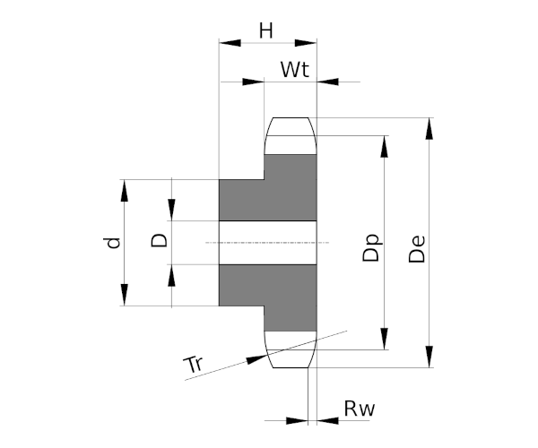

# Chain Sprockets ISO606 simplex 1 1/4" x 3/4" from z 8 to z 76

This folder contains the 3D models of the sprockets for ISO 606 chains simplex 1 1/4" x 3/4" with number of teeth ranging from z=8 to z=76.

All models are parametric and the values are contained in the spreadsheet `Data`.
The parameters refer to the sprocket dimensions as in the drawing below:

Table of dimensions in millimeters:

P (Pitch)|Wc (Chain width)|Dr (Roller diameter)|Tr (Tooth radius)|Rw (Radius width)|Wt (Tooth width)|z (Number of teeth)|De (External Diameter)|Dp (pitch diameter)|d (Hub diameter)|D (Hole diameter)|H (Total height)
---|---|---|---|---|---|---|---|---|---|---|---
31,75|19,56|19,05|32|3,5|18,5|8|98,1|82,96|53|20|40
31,75|19,56|19,05|32|3,5|18,5|9|108|92,84|63|20|40
31,75|19,56|19,05|32|3,5|18,5|10|117,9|102,74|70|20|40
31,75|19,56|19,05|32|3,5|18,5|11|127,8|112,68|77|20|45
31,75|19,56|19,05|32|3,5|18,5|12|137,8|122,68|88|20|45
31,75|19,56|19,05|32|3,5|18,5|13|147,8|132,65|98|20|45
31,75|19,56|19,05|32|3,5|18,5|14|157,8|142,68|108|20|45
31,75|19,56|19,05|32|3,5|18,5|15|167,9|152,72|118|20|45
31,75|19,56|19,05|32|3,5|18,5|16|177,9|162,75|120|25|50
31,75|19,56|19,05|32|3,5|18,5|17|187,9|172,78|120|25|50
31,75|19,56|19,05|32|3,5|18,5|18|198|182,85|120|25|50
31,75|19,56|19,05|32|3,5|18,5|19|208,1|192,91|120|25|50
31,75|19,56|19,05|32|3,5|18,5|20|218,1|202,98|120|25|50
31,75|19,56|19,05|32|3,5|18,5|21|228,2|213,04|140|25|55
31,75|19,56|19,05|32|3,5|18,5|22|238,3|223,11|140|25|55
31,75|19,56|19,05|32|3,5|18,5|23|248,3|233,17|140|25|55
31,75|19,56|19,05|32|3,5|18,5|24|258,4|243,23|140|25|55
31,75|19,56|19,05|32|3,5|18,5|25|268,5|253,33|140|25|55
31,75|19,56|19,05|32|3,5|18,5|26|278,6|263,4|150|25|55
31,75|19,56|19,05|32|3,5|18,5|27|288,6|273,49|150|25|55
31,75|19,56|19,05|32|3,5|18,5|28|298,7|283,56|150|25|55
31,75|19,56|19,05|32|3,5|18,5|29|308,8|293,65|150|25|55
31,75|19,56|19,05|32|3,5|18,5|30|318,9|303,75|150|25|55
31,75|19,56|19,05|32|3,5|18,5|31|329|313,85|150|25|55
31,75|19,56|19,05|32|3,5|18,5|32|339,1|323,91|150|25|55
31,75|19,56|19,05|32|3,5|18,5|33|349,2|334,01|150|25|55
31,75|19,56|19,05|32|3,5|18,5|34|359,3|344,1|150|25|55
31,75|19,56|19,05|32|3,5|18,5|35|369,4|354,2|150|25|55
31,75|19,56|19,05|32|3,5|18,5|36|379,5|364,3|150|25|55
31,75|19,56|19,05|32|3,5|18,5|37|389,5|374,39|150|25|55
31,75|19,56|19,05|32|3,5|18,5|38|399,6|384,49|150|25|55
31,75|19,56|19,05|32|3,5|18,5|39|409,7|394,59|150|25|55
31,75|19,56|19,05|32|3,5|18,5|40|419,8|404,69|150|25|55
31,75|19,56|19,05|32|3,5|18,5|45|470,3|455,17|150|25|70
31,75|19,56|19,05|32|3,5|18,5|50|520,8|505,65|150|25|70
31,75|19,56|19,05|32|3,5|18,5|57|591,5|576,35|150|25|80
31,75|19,56|19,05|32|3,5|18,5|76|783,5|768,32|150|25|80
