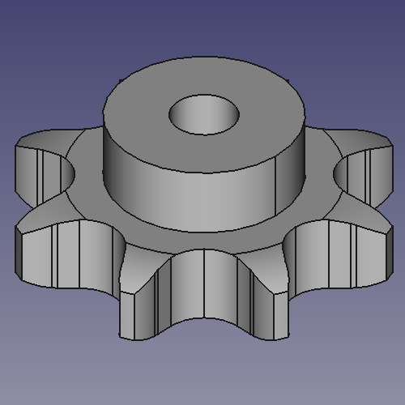

# Chain Sprockets ISO606 simplex 1/2" x 1/8" from z 8 to z 40

This folder contains the 3D models of the sprockets for ISO 606 chains simplex 1/2" x 1/8" with number of teeth ranging from z=8 to z=40.

All models are parametric and the values are contained in the spreadsheet `Data`.
The parameters refer to the sprocket dimensions as in the drawing below:

Table of dimensions in millimeters:

P (Pitch)|Wc (Chain width)|Dr (Roller diameter)|Tr (Tooth radius)|Rw (Radius width)|Wt (Tooth width)|z (Number of teeth)|De (External Diameter)|Dp (pitch diameter)|d (Hub diameter)|D (Hole diameter)|H (Total height)
---|---|---|---|---|---|---|---|---|---|---|---
12,7|3,3|7,75|13|1|3|8|37,2|33,18|21|8|14
12,7|3,3|7,75|13|1|3|9|41,5|37,13|25|8|14
12,7|3,3|7,75|13|1|3|10|46,2|41,1|28|8|14
12,7|3,3|7,75|13|1|3|11|49,6|45,07|31|8|16
12,7|3,3|7,75|13|1|3|12|53,9|49,07|35|8|16
12,7|3,3|7,75|13|1|3|13|58,4|53,06|39|8|16
12,7|3,3|7,75|13|1|3|14|62,8|57,07|43|8|16
12,7|3,3|7,75|13|1|3|15|66,8|61,09|47|8|16
12,7|3,3|7,75|13|1|3|16|70,9|65,1|50|10|18
12,7|3,3|7,75|13|1|3|17|74,9|69,11|50|10|18
12,7|3,3|7,75|13|1|3|18|78,9|73,14|50|10|18
12,7|3,3|7,75|13|1|3|19|82,9|77,16|50|10|18
12,7|3,3|7,75|13|1|3|20|86,9|81,19|50|10|18
12,7|3,3|7,75|13|1|3|21|91|85,22|60|12|20
12,7|3,3|7,75|13|1|3|22|95|89,24|60|12|20
12,7|3,3|7,75|13|1|3|23|99|93,27|60|12|20
12,7|3,3|7,75|13|1|3|24|103|97,29|60|12|20
12,7|3,3|7,75|13|1|3|25|107,1|101,33|60|12|20
12,7|3,3|7,75|13|1|3|26|111,2|105,36|70|16|20
12,7|3,3|7,75|13|1|3|27|115,4|109,4|70|16|20
12,7|3,3|7,75|13|1|3|28|119,4|113,42|70|16|20
12,7|3,3|7,75|13|1|3|29|123,4|117,46|70|16|20
12,7|3,3|7,75|13|1|3|30|127,5|121,5|70|16|20
12,7|3,3|7,75|13|1|3|31|131,5|125,54|70|16|20
12,7|3,3|7,75|13|1|3|32|135,5|129,56|70|16|20
12,7|3,3|7,75|13|1|3|33|139,6|133,6|70|16|20
12,7|3,3|7,75|13|1|3|34|143,6|137,64|70|16|20
12,7|3,3|7,75|13|1|3|35|147,6|141,68|70|16|20
12,7|3,3|7,75|13|1|3|36|151,7|145,72|70|16|25
12,7|3,3|7,75|13|1|3|37|155,7|149,76|70|16|25
12,7|3,3|7,75|13|1|3|38|159,8|153,8|70|16|25
12,7|3,3|7,75|13|1|3|39|163,8|157,83|70|16|25
12,7|3,3|7,75|13|1|3|40|167,8|161,87|70|16|25
