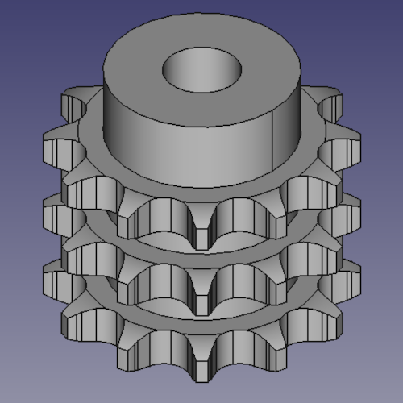

# Chain Sprockets ISO606 triplex 1 3/4" x 1 1/4" from z 8 to z 40

This folder contains the 3D models of the sprockets for ISO 606 chains triplex 1 3/4" x 1 1/4" with number of teeth ranging from z=8 to z=40.

All models are parametric and the values are contained in the spreadsheet `Data`.
The parameters refer to the sprocket dimensions as in the drawing below:

Table of dimensions in millimeters:

P (Pitch)|Wc (Chain width)|Dr (Roller diameter)|Tr (Tooth radius)|Rw (Radius width)|Wt1 (Tooth width 1)|Wt3 (Tooth width 3)|z (Number of teeth)|De (External Diameter)|Dp (pitch diameter)|d (Hub diameter)|D (Hole diameter)|H (Total height)
---|---|---|---|---|---|---|---|---|---|---|---|---
44,45|30,99|27,94|44|5|28,8|148|8|132|116,15|74|30|180
44,45|30,99|27,94|44|5|28,8|148|9|148,4|129,96|88|30|180
44,45|30,99|27,94|44|5|28,8|148|10|162,3|143,85|100|30|180
44,45|30,99|27,94|44|5|28,8|148|11|176,3|157,77|112|30|180
44,45|30,99|27,94|44|5|28,8|148|12|189,5|171,74|125|30|180
44,45|30,99|27,94|44|5|28,8|148|13|204,2|185,74|125|30|180
44,45|30,99|27,94|44|5|28,8|148|14|218,2|199,76|125|30|180
44,45|30,99|27,94|44|5|28,8|148|15|232,3|213,79|145|30|180
44,45|30,99|27,94|44|5|28,8|148|16|246,3|227,84|160|30|180
44,45|30,99|27,94|44|5|28,8|148|17|260|241,91|160|30|180
44,45|30,99|27,94|44|5|28,8|148|18|274|255,98|160|30|180
44,45|30,99|27,94|44|5|28,8|148|19|289|270,06|180|30|180
44,45|30,99|27,94|44|5|28,8|148|20|303|284,15|180|30|180
44,45|30,99|27,94|44|5|28,8|148|21|317|298,24|180|30|180
44,45|30,99|27,94|44|5|28,8|148|22|331|312,34|180|30|180
44,45|30,99|27,94|44|5|28,8|148|23|345|326,44|180|30|180
44,45|30,99|27,94|44|5|28,8|148|24|359|340,55|180|30|180
44,45|30,99|27,94|44|5|28,8|148|25|373|354,66|180|40|180
44,45|30,99|27,94|44|5|28,8|148|26|387|368,77|180|40|180
44,45|30,99|27,94|44|5|28,8|148|27|401,4|382,88|180|40|180
44,45|30,99|27,94|44|5|28,8|148|28|416|397|180|40|180
44,45|30,99|27,94|44|5|28,8|148|29|430|411,12|180|40|180
44,45|30,99|27,94|44|5|28,8|148|30|444|425,24|180|40|180
44,45|30,99|27,94|44|5|28,8|148|31|458|439,37|180|40|180
44,45|30,99|27,94|44|5|28,8|148|35|514|495,88|200|40|180
44,45|30,99|27,94|44|5|28,8|148|38|557|538,27|200|40|180
44,45|30,99|27,94|44|5|28,8|148|40|585|566,54|200|40|180
