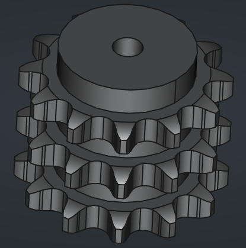
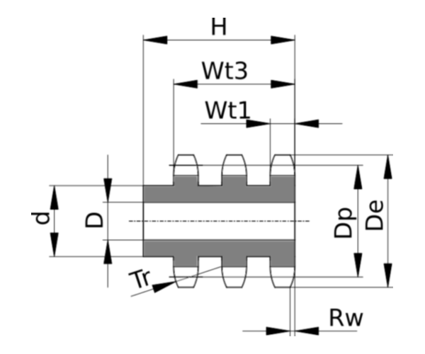

# Chain Sprockets ISO606 triplex 3/4" x 7/16" from z 8 to z 40

This folder contains the 3D models of the sprockets for ISO 606 chains triplex 3/4" x 7/16" with number of teeth ranging from $z=8$ to $z=40$.

All models are parametric and the values are contained in the spreadsheet `Data`.
The parameters refer to the sprocket dimensions as in the drawing below:

Table of dimensions in millimeters:

P (Pitch)|Wc (Chain width)|Dr (Roller diameter)|Tr (Tooth radius)|Rw (Radius width)|Wt1 (Tooth width 1)|Wt3 (Tooth width 3)|z (Number of teeth)|De (External Diameter)|Dp (pitch diameter)|d (Hub diameter)|D (Hole diameter)|H (Total height)
---|---|---|---|---|---|---|---|---|---|---|---|---
19,05|11,68|12,07|19|2|10,8|49,8|8|57,3|49,78|31|16|65
19,05|11,68|12,07|19|2|10,8|49,8|9|62|55,7|37|16|65
19,05|11,68|12,07|19|2|10,8|49,8|10|69|61,64|42|16|65
19,05|11,68|12,07|19|2|10,8|49,8|11|75|67,61|47|20|70
19,05|11,68|12,07|19|2|10,8|49,8|12|81,5|73,6|53|20|70
19,05|11,68|12,07|19|2|10,8|49,8|13|87,5|79,59|59|20|70
19,05|11,68|12,07|19|2|10,8|49,8|14|93,6|85,61|65|20|70
19,05|11,68|12,07|19|2|10,8|49,8|15|99,8|91,63|71|20|70
19,05|11,68|12,07|19|2|10,8|49,8|16|105,5|97,65|77|20|70
19,05|11,68|12,07|19|2|10,8|49,8|17|111,5|103,67|83|20|70
19,05|11,68|12,07|19|2|10,8|49,8|18|118|109,71|89|20|70
19,05|11,68|12,07|19|2|10,8|49,8|19|124,2|115,75|95|20|70
19,05|11,68|12,07|19|2|10,8|49,8|20|129,7|121,78|100|20|70
19,05|11,68|12,07|19|2|10,8|49,8|21|136|127,82|100|20|70
19,05|11,68|12,07|19|2|10,8|49,8|22|141|133,86|100|20|70
19,05|11,68|12,07|19|2|10,8|49,8|23|149|139,9|110|20|70
19,05|11,68|12,07|19|2|10,8|49,8|24|153,9|145,94|110|20|70
19,05|11,68|12,07|19|2|10,8|49,8|25|160|152|120|20|70
19,05|11,68|12,07|19|2|10,8|49,8|26|165,9|158,04|120|20|70
19,05|11,68|12,07|19|2|10,8|49,8|27|172,3|164,09|120|20|70
19,05|11,68|12,07|19|2|10,8|49,8|28|178|170,13|120|20|70
19,05|11,68|12,07|19|2|10,8|49,8|29|184,1|176,19|120|20|70
19,05|11,68|12,07|19|2|10,8|49,8|30|190,5|182,25|120|20|70
19,05|11,68|12,07|19|2|10,8|49,8|31|196,3|188,31|130|25|70
19,05|11,68|12,07|19|2|10,8|49,8|32|203,3|194,35|130|25|70
19,05|11,68|12,07|19|2|10,8|49,8|33|209,3|200,4|130|25|70
19,05|11,68|12,07|19|2|10,8|49,8|34|214,6|206,46|130|25|70
19,05|11,68|12,07|19|2|10,8|49,8|35|221|212,52|130|25|70
19,05|11,68|12,07|19|2|10,8|49,8|36|226,8|218,58|130|25|70
19,05|11,68|12,07|19|2|10,8|49,8|37|232,9|224,64|130|25|70
19,05|11,68|12,07|19|2|10,8|49,8|38|239|230,69|130|25|70
19,05|11,68|12,07|19|2|10,8|49,8|39|245,1|236,75|130|25|70
19,05|11,68|12,07|19|2|10,8|49,8|40|251,3|242,81|130|25|70
