# Mounting

In this folder you can find some parts used for assembling prototypes with 2020 profiles.

Check the images below to see if there is something of your interest.

Feel free to change it to your needs and share it with us. 😀

## Gantry plate

Gantry plate used as mounting place over a 2020 aluminum profile.

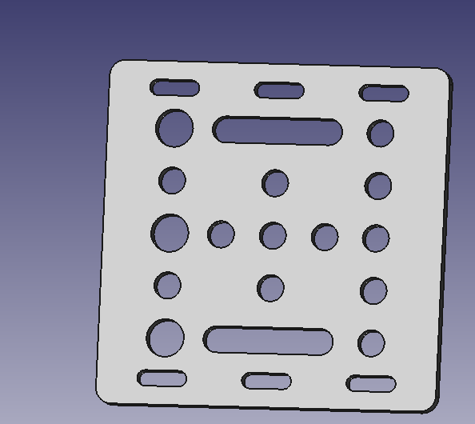

## Generic 2020 profile extrusion

A simple generic 2020 V-slot Aluminium profile extrusion.

You can find more profile extrusions in the `Mechanical Parts/Profiles EN` folder.

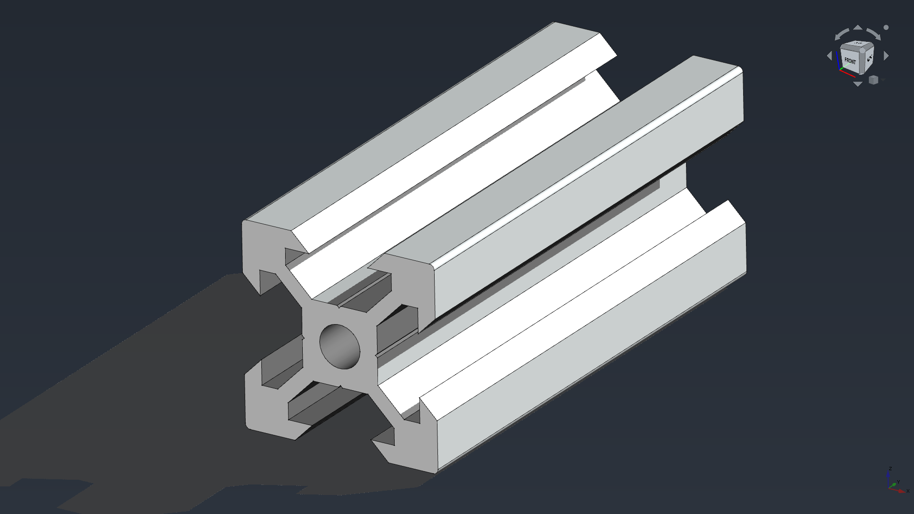

## Corner bracket

A simple corner bracket for joining 2020 profiles

## Linear Shaft Support

Precision stand up linear shaft support. Bore 8[mm].

### SK08, SKXX

Now with the 0.20 version is possible to use a `Configuration table`  to create multiple variants of the same model. In the `SKXX.FCStd` file you will find the SK08, SK10, SK12, SK13, SK16, SK20, SK25, SK30, SK35, SK40, SK50, SK60 models (configurations) in the same file. Learn more about the [Configuration tables here](https://wiki.freecadweb.org/Spreadsheet_Workbench#Configuration_tables).

### SHF08

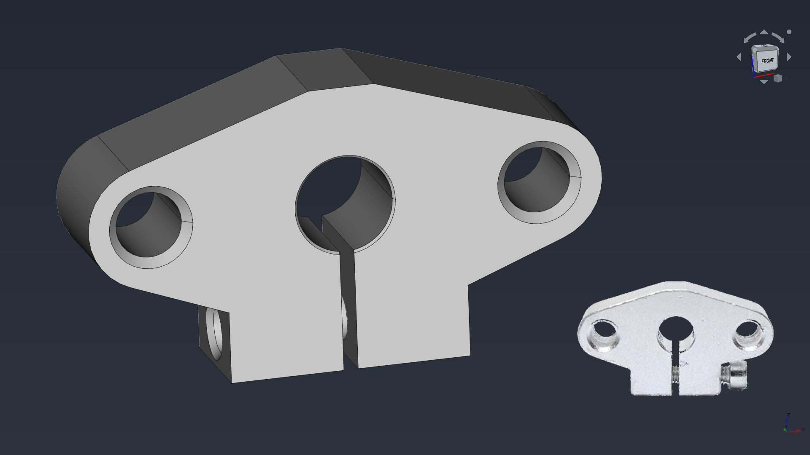

## Joining plates

For joining 2020 profiles in 90 degrees with extra support

### T shape

### L shape

## Bearings

These bearing are usually used in assemblies with 2020 profiles. You can find more specialized bearing in the `Mechanical Parts/Bearings` folder.

### LM8UU

Now with the 0.20 version is possible to use a `Configuration table`  to create multiple variants of the same model. In the `LMXXXUU.FCStd` file you will find the LM6UU, LM6LUU, LM8SUU, LM8UU, LM8LUU, LM10UU, LM10LUU, LM12LUU, LM13LUU, LM16LUU, LM20LUU, LM25LUU, LM30LUU, LM35LUU, LM40LUU, LM50LUU and LM60LUU models (configurations) in the same file. Learn more about the [Configuration tables here](https://wiki.freecadweb.org/)

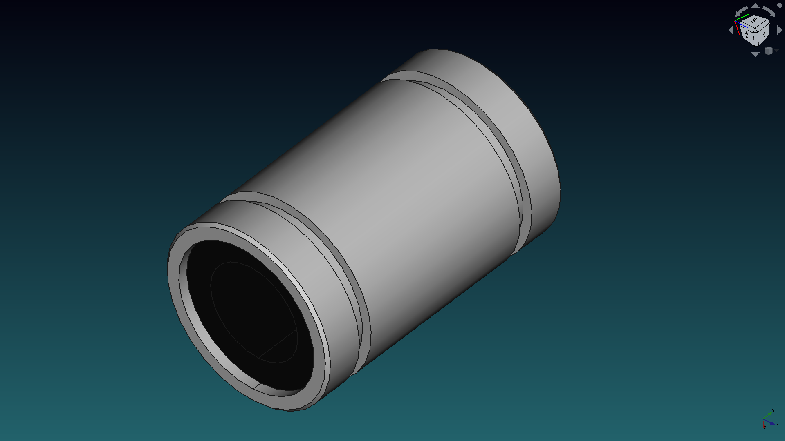

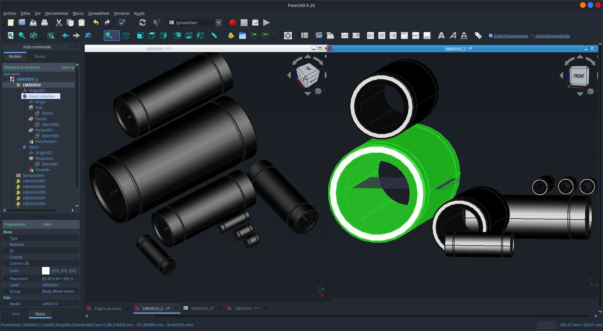

### SC8UU

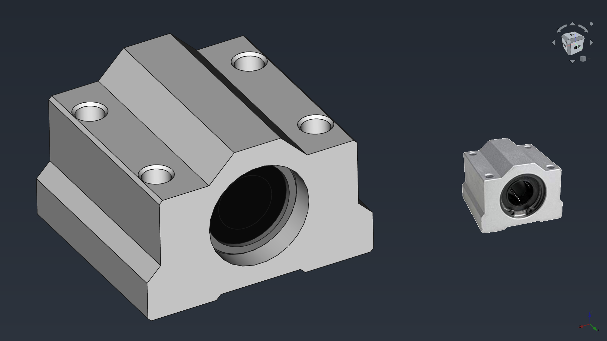

## Pillow blocks

These pillow blocks are usually used in assemblies with 2020 profiles.
The very-detailed bearing model is a courtesy of [Jimmi Henry](https://grabcad.com/jimmi.henry-1), check it out at [grabcad](https://grabcad.com/library/608-skate-board-bearing-1).

### KP08

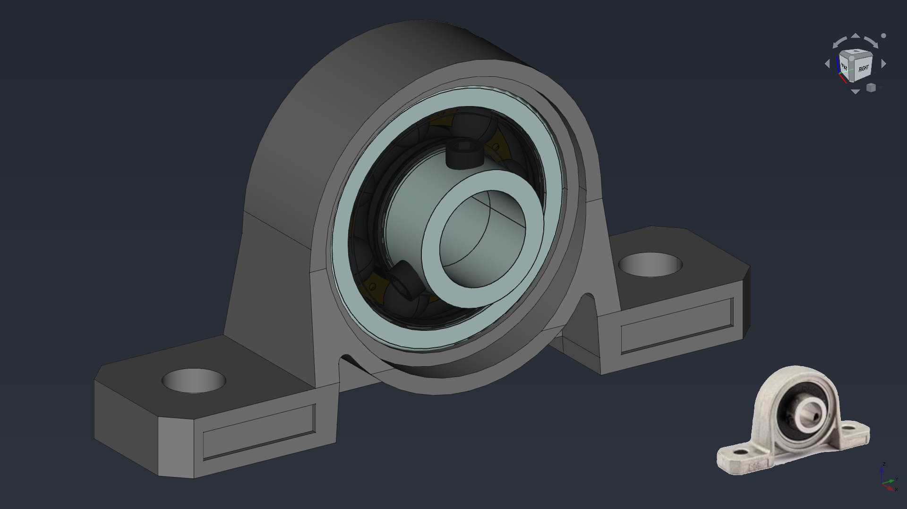

### KFL08

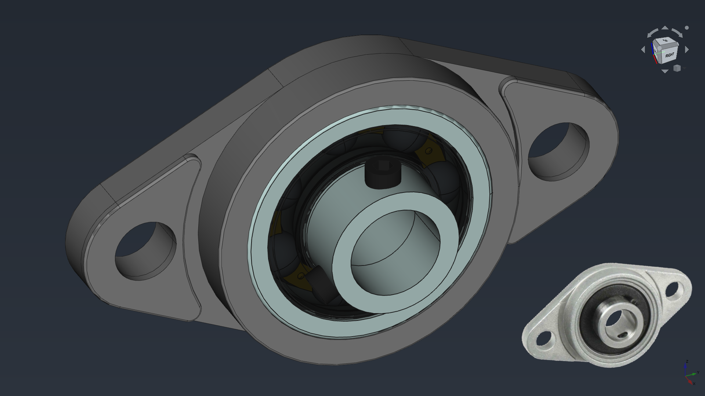

## Leadscrews

Some leadscrew related parts.

### Tr8x8 leadscrew

* Thread: Tr8x8
* Starts: 4
* Lead: 8mm

The first 8 of Tr8 means it is to indicate the *diameter* (8mm) and the second 8 means the *lead*.
8mm lead means when drive by a stepper driver in *Full Step mode*, it moves 8mm per revolution.

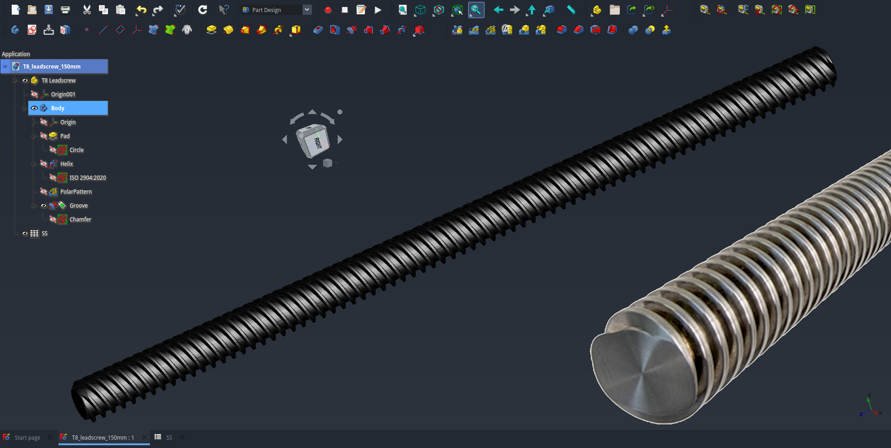

### T8 housing bracket

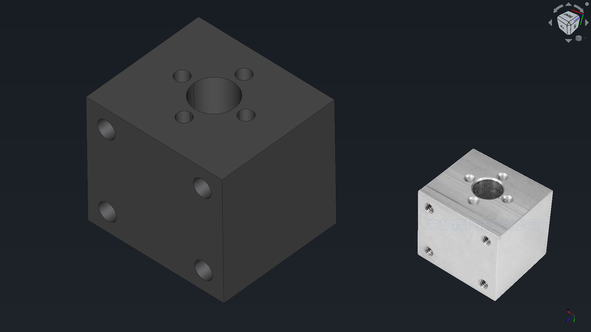

### Nuts

#### Tr8x8 flange nut

**IMPORTANT! Don't open this file in FreeCAD Link Branch from realthunder because of [this bug](https://github.com/realthunder/FreeCAD_assembly3/issues/1120).**

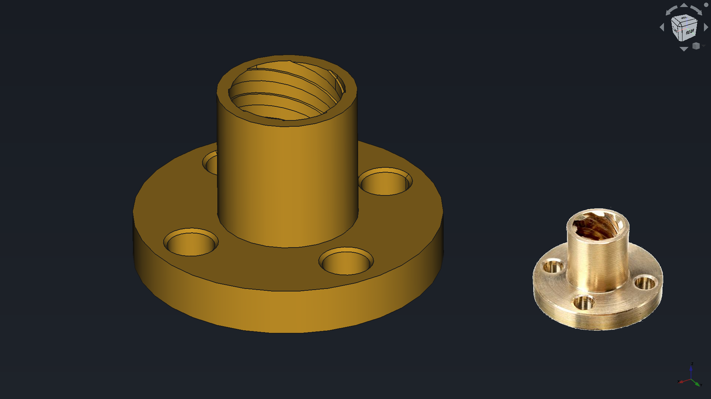

#### Tr8x8 anti backlash nut

**IMPORTANT! Don't open this file in FreeCAD Link Branch from realthunder because of [this bug](https://github.com/realthunder/FreeCAD_assembly3/issues/1120).**

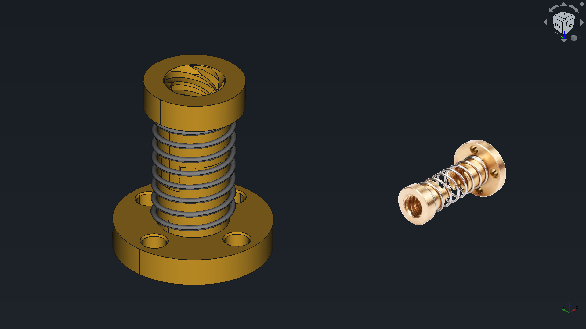

Don´t forget to share your modifications with the community.

## T-slot sliding nut

Sliding nut, there is a spreadsheet with data for different sizes.

