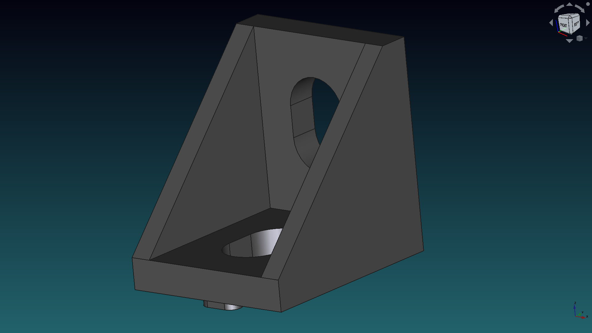
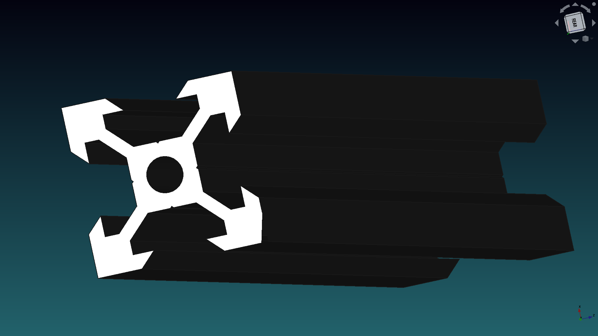
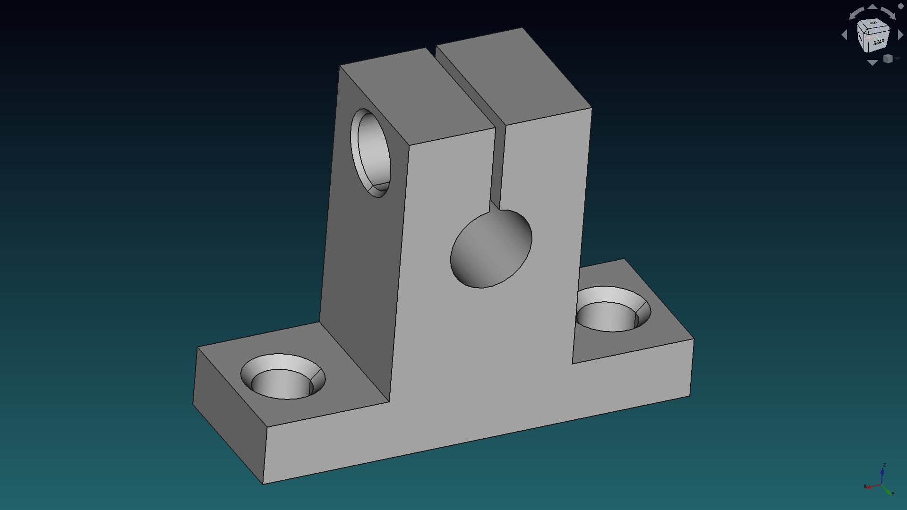
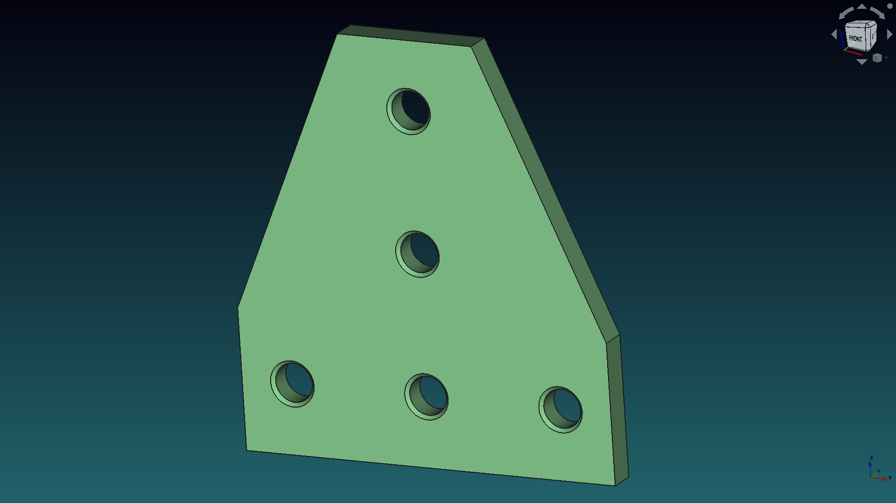
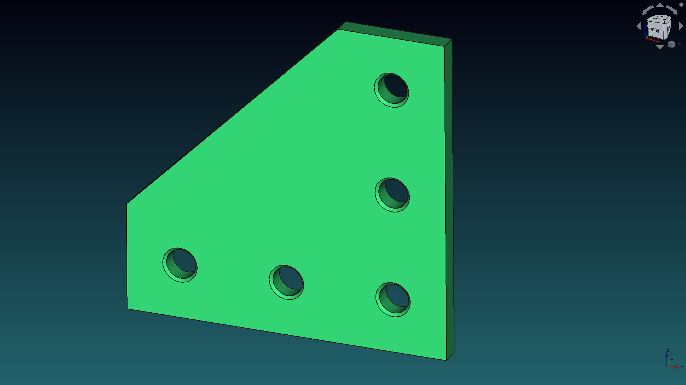

# Mounting

In this folder you can find some parts used for assembling prototypes with 2020 profiles.

Check the images below to see if there is something of your interest.

Feel free to change it to your needs and share it with us. 😀

## Gantry plate

This files have a wrong name. They are named as `v-slot_20mm` but are a gantry plate.

## Corner bracket

A simple corner bracket for joining 2020 profiles

## Generic 2020 profile extrusion

A simple generic 2020 profile extrusion.

You can find more profile extrusions in the `Mechanical Parts/Profiles EN` folder.

## SK08 Linear Shaft Support

Precision stand up linear shaft support. Bore 8[mm].

## Joining plates

For joining 2020 profiles in 90 degrees with extra support

### T shape

### L shape

This model is licensed under CC-BY 3.0.

Don´t forget to share your modifications with the community.