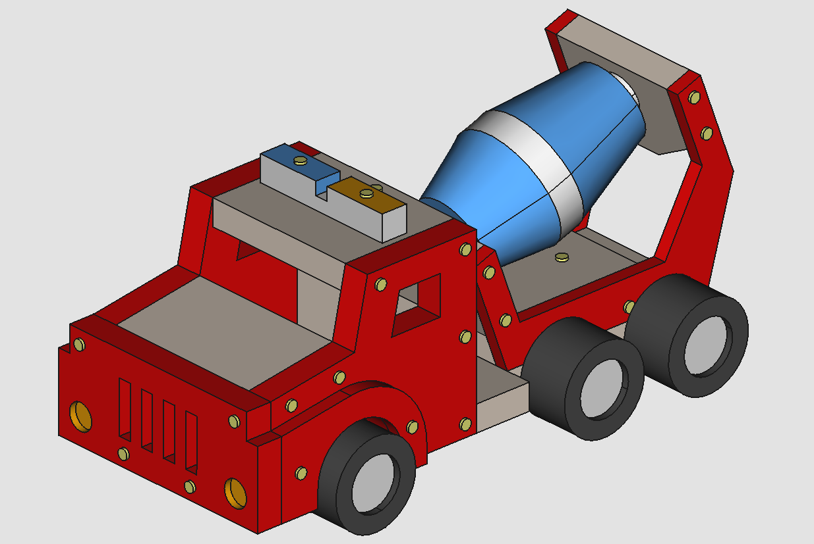

# Scale model - Cement mixer truck

This directory contains the FreeCAD model of a wooden toy [cement mixer truck](https://www.stanleyjr.com/shop/large-building-kit/cement-mixer-truck-kit-copy-2/) used by the [ACRO](https://iiw.kuleuven.be/onderzoek/acro) research unit ([KU Leuven](https://www.kuleuven.be/kuleuven/)) to develop and test state-of-the-art assembly sequence planning algorithms. Each file is available in the .FCStd, .stp and .stl formats.

## Created with
* FreeCAD 0.19 (Daily)
* Ubuntu 18.04.4 LTS

## Author
* [Martijn Cramer](https://github.com/MartijnCramer)

## License
All parts in this repository are licensed under [CC-BY 3.0](https://creativecommons.org/licenses/by/3.0/). Each part is copyrighted by and should be attributed to its respective author(s).

## Acknowledgments
* [KU Leuven](https://iiw.kuleuven.be/english/diepenbeek) @ Diepenbeek Campus
* Automation, Computer vision and Robotics ([ACRO](https://iiw.kuleuven.be/onderzoek/acro)) research unit
